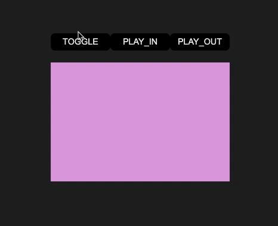

# @wbe/react-transition


A zero dependency React transition component who allows to manage play-in & play-out transitions of any DOM element.

<br>

<br>

## About

React-transition responds to the simple request to have control over the play-in
and play-out transition of any component or DOM element.

React does not by default provide the ability to execute an exit transition
function before a DOM element is destroyed.
[Alexey Taktarov](https://github.com/molefrog) explains this "limitation" with
example in [this publication](https://molefrog.github.io/stateful-animations/#27).

React-transition a "Vuejs
like" [transition API](https://vuejs.org/v2/guide/transitions.html). It's
intended to partially meet the same needs of Vue transition component.

## Install

```shell
$ npm i @wbe/react-transition
```

## Usage

```tsx
import React, {useState} from "react"
import {Transition} from "@wbe/react-transition"
import {gsap} from "gsap/all"

const App = () => {
  const [isToggle, setIsToggle] = useState(true)

  // Example with GSAP
  const playInTransition = (el, done) => {
    gsap.fromTo(el, {autoAlpha: 0}, {autoAlpha: 1, onComplete: done})
  }

  const playOutTransition = (el, done) => {
    gsap.fromTo(el, {autoAlpha: 1}, {autoAlpha: 0, onComplete: done})
  }

  return (
    <div className={"app"}>
      <button onClick={() => setIsToggle(!isToggle)}>Toggle</button>
      <Transition
        if={isToggle}
        playIn={playInTransition}
        playOut={playOutTransition}
      >
        <div className={"element"} />
      </Transition>
    </div>
  )
}
```

## Props

### if

`boolean` _optional_ - default: `true`  
Toggle start play-in / play-out children with transition

### children

`ReactElement`  
React children element to transit

### playIn

`(el: HTMLElement, done: () => any) => void`  _optional_  
Play-in transition function

### onPlayInComplete

`() => void` _optional_  
Function calls when play-in transition function is completed

### playOut

`(el: HTMLElement, done: () => any) => void`  _optional_     
Play-out transition function

### onPlayOutComplete

`() => void` _optional_   
Function calls when play-out transition function is completed

### appear

`boolean` _optional_ - default: `false`    
Start transition on first mount. If false, children is visible but transition
start only when "if" props change

### unmountAfterPlayOut

`boolean` _optional_ - default: `true`   
Unmount children React element after playOut transition

### dispatchPlayState

`(play: TPlay) => void` _optional_   
Dispatch current TPlay string type

<details>
  <summary>Type TPlay</summary>

```ts
type TPlay = "hidden" | "play-out" | "play-in" | "visible";
```

</details>

```tsx
import React, {useEffect, useState} from "react"
import {Transition} from "@wbe/react-transition"

const App = () => {
  // ...
  const [elementPlayState, setElementPlayState] = useState(null);
  useEffect(()=> {
    if (elementPlayState === "play-in") {
      // ...  
    }
  }, [elementPlayState])

  return (
    <>
      <Transition
        // ...
        // Everytime transition playState change, elementPlayState will be updated
        dispatchPlayState={(playState) => setElementPlayState(playState)}
      >
        <div className={"element"} />
      </Transition>
    </>
  )
}
```

## <a name="Example"></a>Example

A use case example is available on this repos.

Install dependencies

```shell
$ npm i
```

Start dev server

```shell
$ npm run dev
```
